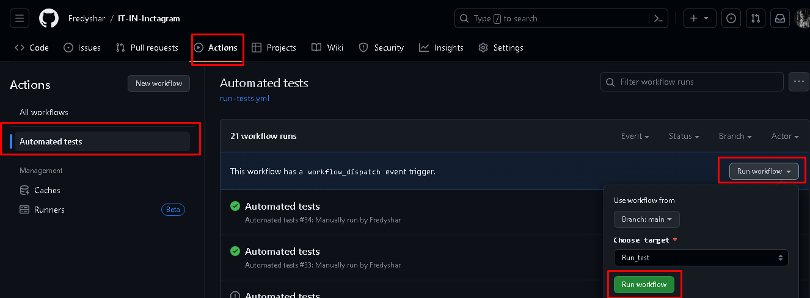

# Привет! 
Это проект по автоматизации тестирования.
Написан на языке Java. Используется Gradle.

Подключен Allure для визуализации отчетов по тестированию. Отчет можно посмотреть здесь: https://fredyshar.github.io/IT-IN-Inctagram/

Подключен CI - Appveyor. Ниже бейдж. Если он зеленый то все тесты пройдены. Если красный есть упавшие тесты.
(Сейчас он красный, т.к. валится тест autoRegistrationAndAuthorization(). Валится т.к. не видит какой то элемент. Но по факту тест проходит. Нужно подробнее изучить логи - [https://vitiaz.atlassian.net/wiki/spaces/V/pages/5734401]()
# CI

Реализован запуск тестов через Git Actions Pages. Для этого нужно:
1. Иметь доступ к редактированию
2. Открыть вклдаку Actions
3. Выбрать слева Automated test
4. Нажать на Run workflow
5. Нажать на Run workflow.
Начнется выполнение тестов в Git. 
ВАЖНО: после прохождения тестов отчет будет доступен в течении 5-10 минут, до этого будет отображатся прошлый запуск. В отчете отображается история запусков.

